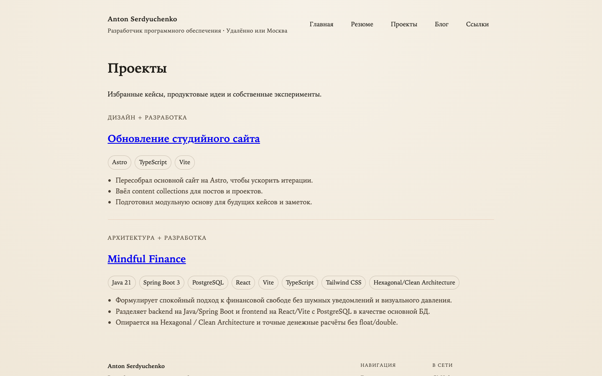
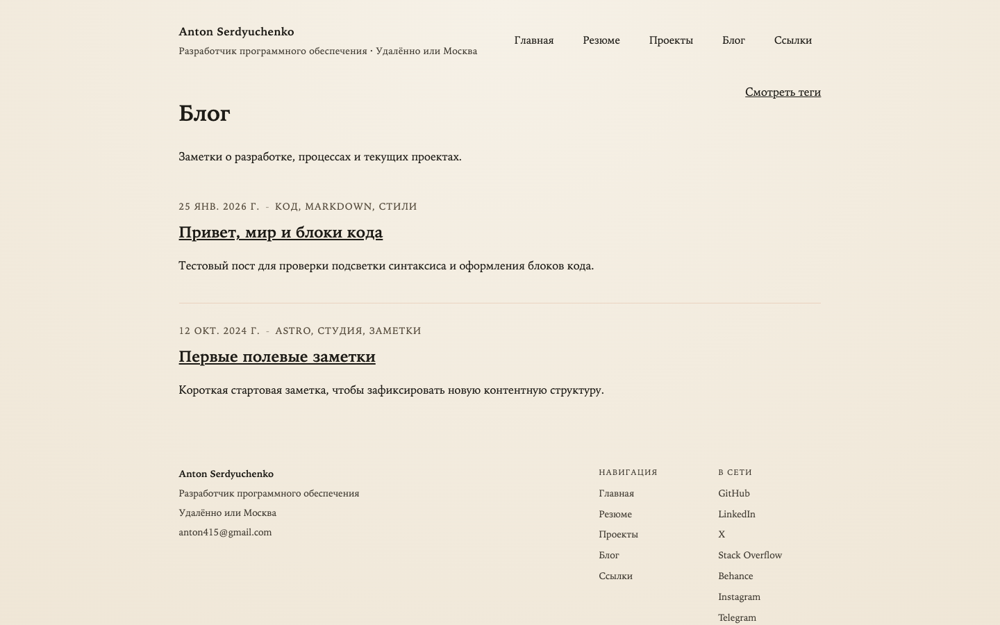

# anton415.github.io

Персональный сайт Антона Сердюченко на [Astro](https://astro.build/): проекты, блог, резюме и основные ссылки в одном репозитории. Здесь хранятся исходники интерфейса, Markdown-контент и GitHub Actions для проверки и публикации сайта на GitHub Pages.

[](https://github.com/anton415/anton415.github.io/actions/workflows/pr-ci.yml)
[](https://github.com/anton415/anton415.github.io/actions/workflows/pages.yml)
[](https://serdyuchenko.com/)
[](https://astro.build/)

## О проекте

`anton415.github.io` это персональный сайт-портфолио, где собраны материалы о работе, проектах и заметках Антона Сердюченко.

- `Главная` показывает краткое позиционирование, ключевые ссылки и избранные материалы.
- `Проекты` собирают кейсы, продуктовые идеи и собственные эксперименты.
- `Блог` содержит заметки о разработке, процессах и текущих задачах.
- `Резюме` даёт структурированный обзор опыта.
- `Ссылки` ведут на внешние профили и каналы связи.

Основа проекта: `Astro`, Markdown content collections и деплой на `GitHub Pages`.

## Скриншоты

| Главная | Проекты | Блог |
| --- | --- | --- |
|  |  |  |

## Сборка

Требования: `Node.js 20` и `npm`.

```bash
npm install
npm run dev
npm run build
npm run preview
npm run lint
```

- `npm install` устанавливает зависимости проекта.
- `npm run dev` запускает локальный dev-сервер Astro.
- `npm run build` собирает production-версию сайта в `dist/`.
- `npm run preview` поднимает локальный preview собранного сайта.
- `npm run lint` проверяет код и шаблоны через ESLint.

## Использование

Для локальной работы установите зависимости и запустите `npm run dev`, затем откройте `http://localhost:4321`.

Контент проекта хранится в:

- `src/content/posts/` для постов блога.
- `src/content/projects/` для проектов и кейсов.

Подробный процесс публикации, требования к frontmatter и рекомендации по изображениям описаны в [docs/content-workflow.md](docs/content-workflow.md).

Публикация сайта настроена через GitHub Actions и выполняется при пуше в `master` или `main`.

## Контакты

- Email: [anton415@gmail.com](mailto:anton415@gmail.com)
- GitHub: [github.com/anton415](https://github.com/anton415)
- LinkedIn: [linkedin.com/in/antonserdyuchenko](https://www.linkedin.com/in/antonserdyuchenko/)
- Telegram: [t.me/antonserdyuchenko](https://t.me/antonserdyuchenko)
