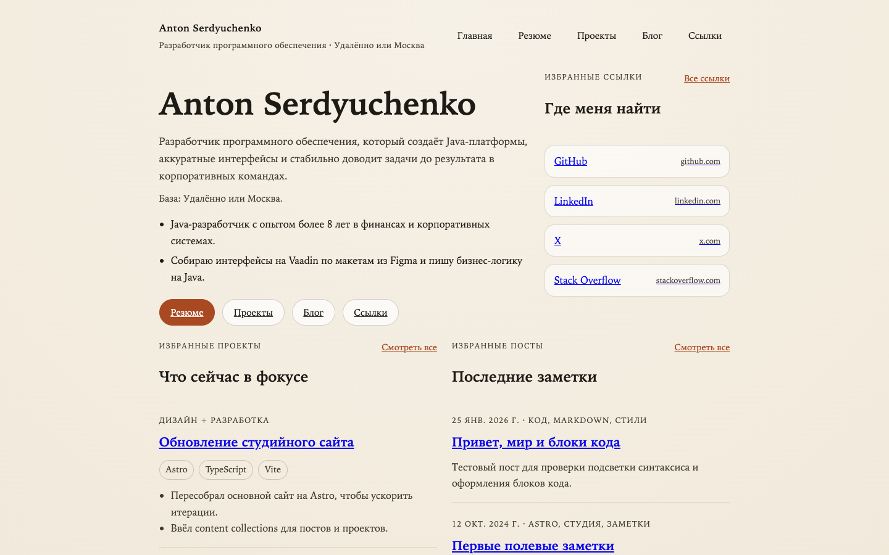

# anton415.github.io

Персональный сайт Антона Сердюченко на [Astro](https://astro.build/): одностраничное резюме и основные ссылки в одном репозитории. Здесь хранятся исходники интерфейса, данные резюме и GitHub Actions для проверки и публикации сайта на GitHub Pages.

[](https://github.com/anton415/anton415.github.io/actions/workflows/pr-ci.yml)
[](https://github.com/anton415/anton415.github.io/actions/workflows/pages.yml)
[](https://serdyuchenko.com/)
[](https://astro.build/)

## О проекте

`anton415.github.io` это персональный сайт-резюме Антона Сердюченко: один структурированный обзор опыта на главной странице и хаб со ссылками на внешние профили.

- `Резюме` (`/`) — главная и единственная содержательная страница: опыт, образование, навыки и проекты.
- `Ссылки` (`/links`) — внешние профили и каналы связи.

Разделы «Проекты» и «Блог» были убраны при релонче в одностраничное резюме; архитектура оставлена модульной, чтобы вернуть их позже (см. [anton415-ru-relaunch-plan.md](anton415-ru-relaunch-plan.md)).

Основа проекта: `Astro`, данные резюме в `src/data/*.ts` и деплой на `GitHub Pages`.

## Скриншоты

| Резюме                                                                                      |
| ------------------------------------------------------------------------------------------- |
|  |

## Сборка

Требования: `Node.js 22` (как в CI) и `npm`.

```bash
npm install
npm run dev
npm run build
npm run preview
npm run lint
```

- `npm install` устанавливает зависимости проекта.
- `npm run dev` запускает локальный dev-сервер Astro.
- `npm run build` собирает production-версию сайта в `dist/`.
- `npm run preview` поднимает локальный preview собранного сайта.
- `npm run lint` проверяет код и шаблоны через ESLint.

## Использование

Для локальной работы установите зависимости и запустите `npm run dev`, затем откройте `http://localhost:4321`.

Контент резюме хранится не в Markdown, а в типизированных модулях `src/data/`:

- `src/data/cv.ts` — опыт, образование, навыки и проекты.
- `src/data/profile.ts` — имя, должность и контакты.
- `src/data/links.ts` — навигация и внешние профили.
- `src/data/site.ts` — мета-данные сайта (title, description, OG).

Как редактировать данные резюме описано в [docs/content-workflow.md](docs/content-workflow.md).

Публикация сайта настроена через GitHub Actions и выполняется при пуше в `master` или `main`.

## Контакты

- Email: [anton415@gmail.com](mailto:anton415@gmail.com)
- GitHub: [github.com/anton415](https://github.com/anton415)
- LinkedIn: [linkedin.com/in/antonserdyuchenko](https://www.linkedin.com/in/antonserdyuchenko/)
- Telegram: [t.me/antonserdyuchenko](https://t.me/antonserdyuchenko)
